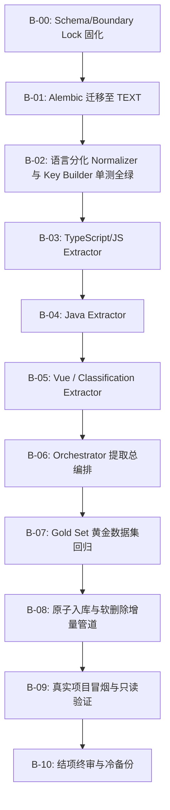

# LKIO MVP2-B 实施基线与边界锁定 — Symbol Extraction (Lock v0.3)

> **阶段代号**：**MVP2-B**  
> **阶段全称**：**Code Intelligence — Symbol Extraction (代码符号提取)**  
> **状态宣告**：**READY_TO_IMPLEMENT (SCHEMA_LOCKED, EXTRACTION_BOUNDARY_LOCKED)**  
> **前置阶段状态**：  
> - **MVP0 = COMPLETED / FROZEN**  
> - **MVP1 = COMPLETED / FROZEN**  
> - **MVP2-A = COMPLETED / FROZEN** (Tree-sitter 基础设施与 Vue SFC 坐标金标准)  
> **核心使命**：将规范化 AST 转换为 `SYMBOL Entity` + `Symbol Metadata` + `(FILE ── defines ──► SYMBOL)`，准确提取代码中“定义了什么、是什么结构类型、叫什么、位于哪里、签名与 AST 属性”，绝不引入调用图、契约追溯、LLM 或业务推理。

---

## 🛑 永久冻结的 6 大架构红线核查

1. **三个源项目只读**：`HELLO_FE`, `HELLO_BE`, `L2C_FE` 绝对物理只读。测试前后严格执行 `git status --porcelain` 比对。
2. **严禁解析 .git 内部结构**：纯粹通过 Git CLI 与文件系统只读流分析，0 `.git` 内部二进制反序列化。
3. **Git 一律通过 subprocess 调用 Git CLI**：统一调用系统原生 Git CLI，保留完整安全审计。
4. **敏感文件永不进入 Knowledge Core**：`.env`, 密钥 (`*.pem`, `*.key`), Token, 私钥, 证书等绝对物理阻断。
5. **严禁伪置信度**：所有静态提取的符号与 `defines` 关系严格赋予 `confidence = 1.00000`，`method = "static_ast"`。
6. **AST 是客观结构事实，绝无业务推理**：符号提取完全由 Tree-sitter AST 解析完成，0 LLM、0 业务猜测。

---

## 🔒 4 项核心 Schema 与抽取边界锁定 (Boundary Lock)

### 锁定 1: entity_key 存储升级为 TEXT NOT NULL UNIQUE (0 截断)
- `entities.entity_key` 升级为 `TEXT NOT NULL UNIQUE`，彻底消除 `VARCHAR(512)` 潜在溢出截断风险。
- **红线**：严禁 `key[:512]` 截断，保留完整逻辑 Key，杜绝碰撞风险。

### 锁定 2: Hook 抽取边界严格限制为“符号定义”
- **MVP2-B 范围**：仅识别 Hook **定义**（例如 `function useAuth() {}`），产出 `symbol_type = "HOOK"`, `base_symbol_type = "FUNCTION"`, `classification_method = "name_prefix_rule_v1"`。
- **严禁包含 Hook 调用**：如 `const { auth } = useAuth()` 属于调用事实，严格划入 **MVP2-C (`CALL_SITE / CALLS`)**。

### 锁定 3: Component 识别采用严密“组合规则分类”
- **红线**：禁止仅凭 `return JSX` 就认定为组件。
- 组合条件：
  1. JSX 返回 / JSX 元素包含
  2. 组件命名规则（严格 PascalCase，如 `LeadList`）
  3. 函数/组件结构形态
- 例如：`function LeadList() { return 
 }` 分类为 `COMPONENT` (`jsx_function_component_v1`)；而普通小驼峰辅助函数 `function createMarkup() { return 
 }` 归为 `FUNCTION`。
- Vue SFC 单文件组件：天然具备组件上下文，使用 `vue_sfc_rule_v1`。

### 锁定 4: 语言分化的规范签名 (Language-Specific Canonical Signature)
统一公式：`signature_discriminator = SHA256(canonical_signature)[:16]`。针对不同语言分别提取：
- **TypeScript / JavaScript**：
  - 提取形参类型、参数个数、可选修饰符（`?`）、Rest 形参（`...`）。
  - `(id: string, count: number)` ➔ `(string,number)`
  - `(id?: string)` ➔ `(string?)` （与非可选严格区分）
  - `(...ids: string[])` ➔ `(...string[])`
- **Java**：
  - 提取参数类型序列，精确区分重载：
  - `list(String)` ➔ `(String)`
  - `list(String, Integer)` ➔ `(String,Integer)`
  - `list(Long)` ➔ `(Long)`
  - 构造器统一：`symbol_type = METHOD`, `method_kind = CONSTRUCTOR`
- **无参数/无签名符号** (`CLASS`, `VARIABLE`, `ENUM`, `TYPE`)：
  - `canonical_signature = ""`
  - `signature_discriminator = "e3b0c44298fc1c14"` (固定 SHA256("")[:16])

---

## 📋 顺序锁执行纪律 (Execution Order Lock)

**第一步严格执行 B-00 → B-01 → B-02**。在 Deterministic Key + Normalizer + Schema 单测未全部通过前，严禁进入后续 Extractor 编码。
