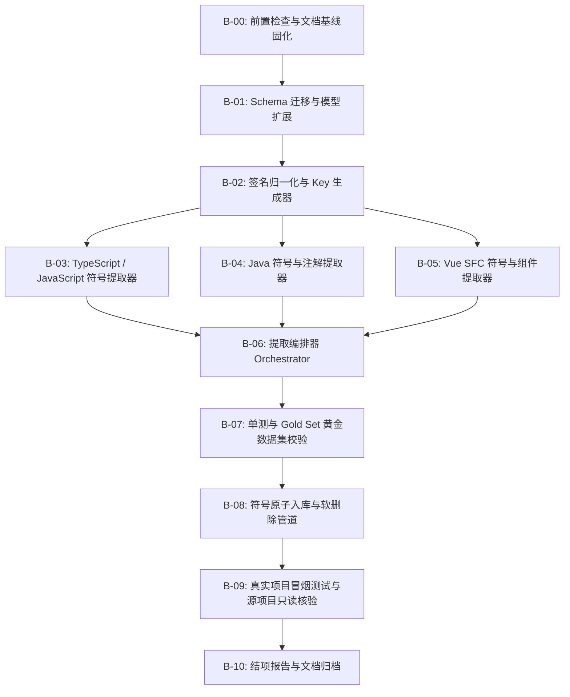

# LKIO MVP2-B 实施规划 — 代码符号提取 (Symbol Extraction Plan)

> **当前阶段**：**MVP2-B (Code Intelligence - Symbol Extraction)**  
> **前置阶段状态**：  
> - **MVP0 = COMPLETED / FROZEN**  
> - **MVP1 = COMPLETED / FROZEN**  
> - **MVP2-A (Preflight) = COMPLETED / FROZEN** (43 项自动化测试全绿，Tree-sitter 依赖与 grammar ABI 锁版完成，Vue SFC 8 组行号金标准对齐通过)  
> **当前状态**：**READY_TO_IMPLEMENT**  
> **规划基准**：`docs/mvp/MVP2实施基线LKIO — Code Intelligence & Structural Graph.md`  
> **核心使命**：从规范化 AST 中提取代码符号事实（类、接口、函数、方法、变量、字段、枚举、类型、注解定义），生成确定性 Key，解耦 AST 原生事实与规则分类（Component / Hook），原子入库并建立 `FILE ── defines ──► SYMBOL` 关系。

---

## 🛑 永久冻结的 6 大架构红线核查

| 红线编号 | 红线内容 | MVP2-B 遵守与防护策略 |
|---|---|---|
| **红线 1** | **三个源项目只读** | 所有分析均基于只读文件流读取，严禁任何写回、格式化或临时文件生成。每个测试用例前后执行 `git status --porcelain` 校验。 |
| **红线 2** | **严禁解析 .git 内部结构** | 严禁读取 `.git/` 内部二进制文件与 refs。 |
| **红线 3** | **Git 一律通过 subprocess 调用 Git CLI** | 统一调用系统原生 Git CLI，保留完整安全审计。 |
| **红线 4** | **敏感文件永不进入 Knowledge Core** | 继承 MVP1 敏感文件物理阻断过滤器（`.env*`, `*.pem`, `*.key` 等）。 |
| **红线 5** | **严禁伪置信度** | 所有静态提取的符号与关系严格标记 `confidence = 1.00000`，`method = "static_ast"`，绝不虚构浮动置信度。 |
| **红线 6** | **AST 是结构事实，不是业务推理** | 严格提取客观 AST 结构事实（函数签名、行范围、修饰符、注解），绝对不引入 LLM 猜测业务语义。 |

---

## 🔒 MVP2-B 关键架构与 Schema 冻结原则 (3 大锁定)

### 锁定 1: 原生 Symbol Type 完备化 (9 种原生类型)
MVP2-B 正式冻结 9 种 AST 原生符号类型枚举：
- `CLASS`: 类定义 (TS/JS/Java)
- `INTERFACE`: 接口定义 (TS/Java)
- `FUNCTION`: 顶层函数 / 独立函数 / 导出函数
- `METHOD`: 类或对象内部的方法（包含构造器）
- `VARIABLE`: 变量 / 常量声明
- `FIELD`: 类属性 / 字段 (Java Field, TS Property)
- `ENUM`: 枚举定义 (TS/Java)
- `TYPE`: 类型别名定义 (`type X = ...` in TS)
- `ANNOTATION`: **仅限注解定义**（Java `@interface Foo`）。注解的使用（如 `@RestController`, `@Autowired`）作为被标注符号的 `metadata["annotations"]` 存储，绝不将注解使用本身当作独立符号。

### 锁定 2: 规则分类 (Component / Hook) 与 AST 原生事实严格解耦
- `COMPONENT` 与 `HOOK` 作为高层规则分类，**其 `base_symbol_type` 必须严格属于上述 9 种原生受控枚举**，绝不允许 `base_symbol_type="OBJECT"` 等未定义类型入库。
- 提取候选体必须同时保留：
  - `symbol_type`: 规则分类结果（如 `HOOK` 或 `COMPONENT`）
  - `base_symbol_type`: 原生 AST 事实（如 `FUNCTION` 或 `VARIABLE`）
  - `classification_method`: 分类方法（如 `name_prefix_rule`, `vue_sfc_rule`, `jsx_return_rule`）

### 锁定 3: 确定性 Symbol Key 彻底解耦 `start_line` (防止行漂移)
为了防止源文件增删行导致已提取符号的 Key 发生无谓失效，Symbol Key **绝对不包含行号**：
```text
SYMBOL:<project_key>:<file_rel_path>:<base_symbol_type>:<qualified_name>:<signature_discriminator>
```
其中：
- `project_key`: 项目键（如 `HELLO_FE`, `HELLO_BE`, `L2C_FE`）
- `file_rel_path`: 规范化相对路径（统一使用正斜杠 `/`）
- `base_symbol_type`: 9 大受控原生类型之一
- `qualified_name`: 层级限定名称（如 `CustomerController.createLead`）
- `signature_discriminator`: `SHA256(normalized_signature)[:16]`
  - `normalized_signature` 为去除冗余空白符与参数名差异后的标准化形参签名（如 `(String,Integer)` 或 `(id:string,count:number)`）。
  - 若无签名（如变量、类），统一使用空字符串 `""` 的哈希前缀 `e3b0c44298fc1c14`。

---

## 🛠️ MVP2-B 实施步骤拆解与执行路线图



### 任务清单 (Tasks)

1. **Task B-00: 前置状态检查与基线文档对齐**
   - 检查 `MVP0=COMPLETED`, `MVP1=COMPLETED`, `MVP2-A=COMPLETED`。
   - 登记 3 大 Schema 锁。

2. **Task B-01: 数据库 Schema 迁移**
   - 编写 Alembic 迁移脚本：将 `entities.entity_key` 从 `VARCHAR(255)` 扩展至 `VARCHAR(512)`，防止极长路径与方法名组合溢出。
   - 更新 `core/parsing/models.py` 与 `ingestion/code/dto.py` 枚举。

3. **Task B-02: 签名归一化与确定性 Key 生成器 (`core/extraction/normalizer.py`)**
   - 实现 `compute_signature_discriminator(signature)`。
   - 实现 `build_symbol_key(project_key, file_rel_path, base_symbol_type, qualified_name, signature)`。
   - 单元测试覆盖行漂移不敏感性。

4. **Task B-03: TypeScript / JavaScript 符号提取器 (`core/extraction/typescript.py`)**
   - 支持 `.ts`, `.tsx`, `.js`, `.jsx`。
   - 提取 `CLASS`, `INTERFACE`, `FUNCTION`, `METHOD`, `VARIABLE`, `ENUM`, `TYPE`。
   - Hook 识别：`^use[A-Z0-9].*` ➔ `HOOK` (base: `FUNCTION`, method: `name_prefix_rule`)。
   - Component 识别：JSX 返回值规则 ➔ `COMPONENT` (base: `FUNCTION`, method: `jsx_return_rule`)。

5. **Task B-04: Java 符号与注解提取器 (`core/extraction/java.py`)**
   - 支持 `.java`。
   - 提取 `CLASS`, `INTERFACE`, `ENUM`, `ANNOTATION` (`@interface`), `METHOD` (含构造器), `FIELD`。
   - 提取方法形参类型用于重载区分。
   - 提取并挂载类与方法上的注解列表（如 `@RestController`, `@PostMapping`）到 `metadata["annotations"]`。

6. **Task B-05: Vue SFC 符号与组件提取器 (`core/extraction/vue.py`)**
   - 利用 `SfcBlockSlicer` 保持物理行号不变。
   - 提取组件本体为 `COMPONENT` 符号 (base: `FUNCTION` 或 `VARIABLE`)。
   - 提取 `<script>` 与 `<script setup>` 内声明的函数、变量、Hook 调用。

7. **Task B-06: 提取编排器 (`core/extraction/orchestrator.py`)**
   - 统一入口 `extract_file_symbols(file_path, project_key, file_rel_path, code_bytes)`。

8. **Task B-07: 单测与 Gold Set 黄金数据集**
   - 构建 `tests/gold/mvp2/symbols/` 包含 TS, TSX, Java, Vue 4 组黄金样本。
   - 编写 `tests/unit/test_symbol_extraction.py`，执行快速自测（<5秒）。

9. **Task B-08: 符号原子入库与软删除增量管道**
   - 在 `ingestion/symbols.py` 中实现单文件事务：
     - 查询现有活跃符号集合。
     - 批量 upsert 新提取符号到 `entities`。
     - 批量建立 `FILE ── defines ──► SYMBOL` 关系。
     - 对本轮消失的符号标记 `status = "deleted"`。

10. **Task B-09: 真实工程冒烟与只读验证**
    - 在 `HELLO_FE`, `HELLO_BE`, `L2C_FE` 真实代码样本上运行提取与入库。
    - 验证 `git status --porcelain` 严格不变。

11. **Task B-10: 结项报告与文档归档**
    - 编写 `docs/mvp2/mvp2_b_symbol_extraction_report.md`。
    - 更新 `docs/mvp2/MVP2_STATUS.md`。
