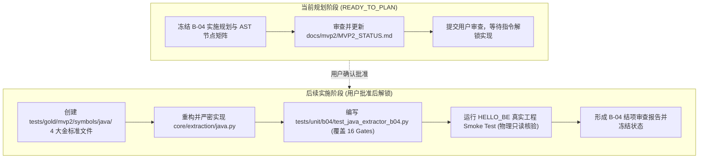

# LKIO MVP2-B B-04 实施规划 — Java Symbol Extractor

> **阶段**：**MVP2-B (Step 2.2 — B-04)**  
> **当前状态**：**READY_TO_PLAN (规划冻结阶段，严禁直接编写提取代码)**  
> **前置阶段状态终审核查**：  
> - **MVP0 = COMPLETED / FROZEN**  
> - **MVP1 = COMPLETED / FROZEN**  
> - **MVP2-A = COMPLETED / FROZEN**  
> - **B-00 (Schema 与边界锁) = COMPLETED / FROZEN**  
> - **B-01 (Database TEXT 迁移) = COMPLETED / FROZEN**  
> - **B-02 (符号身份与标准化体系) = COMPLETED / FROZEN (5/5 判据闭环，13 项单测全绿)**  
> - **B-03 (TypeScript/JavaScript Extractor) = COMPLETED / FROZEN (AUDIT-01/02 闭环，16 门禁全绿)**  
> - **B-04 (Java Extractor) = READY_TO_PLAN (本规划)**  
> - **B-05..B-10 = LOCKED (严禁越级执行)**  
> **执行约束**：本阶段为纯规划阶段。严禁修改或编写生产提取代码，严禁触碰 Vue SFC (B-05)、图谱关系 (B-06/MVP2-C)、Spring API Trace (MVP2-E) 或 DB 持久化。

---

## 一、对照前置阶段 (B-00 ~ B-03) 架构纪律审查

在启动 B-04 规划前，先执行前置阶段验收基线审计：
1. **B-00 边界规范**：已锁定 9 大受控 Native 类型与规则分类机制，确立 AST 结构事实与业务推理物理隔离。
2. **B-01 存储规范**：已完成 PostgreSQL `entities.entity_key` 升级为 `TEXT NOT NULL UNIQUE`，杜绝长 Key 截断风险。
3. **B-02 身份规范**：
   - 已完成 `canonicalize_java_signature` 算法：参数类型序列保留、注解剥离、`final` 剥离、varargs `...` 保留。
   - 已锁定词法作用域统一分隔符：`::`（如 `LeadController::list`、`LeadController::leadService`、`LeadController::InnerHelper::help`）。
   - 已完成 5 大判据验证（Criterion 3 针对 Java 重载方法分化已通过 100% 单元测试断言）。
4. **B-03 交付规范**：
   - 已完成 AUDIT-01（测试物理隔离到 `tests/unit/b03/`）。
   - 已完成 AUDIT-02（JS 无类型参数真实保留为 `?`，杜绝伪造 `any`）。
   - 16 项 Acceptance Gate 全绿，三大源工程物理只读性 0 污染。

---

## 二、B-04 核心目标与定位

### 1. 唯一使命
基于 Tree-sitter Java grammar (`tree-sitter-java == 0.23.5`)，对 Java 编译单元（`.java` 文件）执行确定性、无歧义、免行号漂移的静态 AST 符号提取，输出 `list[SymbolCandidate]` DTO。

提取的原生符号类型覆盖：
- `CLASS`（类声明，包含普通类、抽象类、静态内部类、Record）
- `INTERFACE`（接口声明，包含顶层接口、嵌套接口）
- `ENUM`（枚举声明，包含枚举常量与枚举体方法/字段）
- `ANNOTATION`（仅限于 `@interface` 注解定义本身，Lock 1）
- `FIELD`（类、接口、枚举内部的成员字段/常量声明）
- `METHOD`（普通方法、抽象方法、默认方法、静态方法）
- 构造器：标准化映射为 `symbol_type = "METHOD"`，`base_symbol_type = "METHOD"`，`metadata["method_kind"] = "CONSTRUCTOR"`（Lock 2）

### 2. 严禁触碰的边界 (Out of Scope for B-04)
- **严禁生成图谱关系**：严禁在此阶段构建 `CALLS`、`IMPORTS`、`EXTENDS`、`IMPLEMENTS` 等 Relation 图谱边（留待 B-06 / Step 2.3 MVP2-C）。
- **严禁 Spring API 端到端推理**：严禁推导 Controller ➔ Service ➔ Mapper ➔ DB 追溯链（留待 Step 2.5 MVP2-E）。
- **严禁数据库持久化**：仅输出内存态 `SymbolCandidate`，不执行 DB 写入或同步（留待 B-07 / Ingestion）。
- **严禁 AI / LLM 幻觉推断**：所有符号属性均来自 Tree-sitter AST 客观节点，置信度固定为 `1.0`（证据方法 `static_ast`）。

---

## 三、Tree-sitter Java AST 节点映射矩阵 (Grammar 0.23.5)

基于对 Tree-sitter Java 0.23.5 语法树实机探测，确立如下精确节点映射规则：

| 语法结构 | Tree-sitter 节点类型 (`node.type`) | LKIO `symbol_type` | LKIO `base_symbol_type` | 关键提取字段与元数据 |
|---|---|---|---|---|
| **类声明** | `class_declaration` | `CLASS` | `CLASS` | 名称: `name`, 继承: `superclass`, 实现: `interfaces`, 泛型: `type_parameters`, 修饰符, 注解 |
| **接口声明** | `interface_declaration` | `INTERFACE` | `INTERFACE` | 名称: `name`, 继承接口: `extends_interfaces`, 泛型: `type_parameters`, 修饰符, 注解 |
| **枚举声明** | `enum_declaration` | `ENUM` | `ENUM` | 名称: `name`, 实现: `interfaces`, 枚举项: `enum_constants`, 修饰符, 注解 |
| **注解定义** | `annotation_type_declaration` | `ANNOTATION` | `ANNOTATION` | 名称: `name`, 元注解: `@Target`, `@Retention`, 属性项: `annotation_type_element_declaration` |
| **Record 类** | `record_declaration` | `CLASS` | `CLASS` | 名称: `name`, 组件: `record_components`, `metadata["class_kind"]="record"` |
| **普通方法** | `method_declaration` | `METHOD` | `METHOD` | 名称: `name`, 返回类型: `type`, 参数: `formal_parameters`, 异常: `throws`, 签名特征码 |
| **构造方法** | `constructor_declaration` | `METHOD` | `METHOD` | 名称: `<init>` (源码名记录于 `metadata["raw_name"]`), `metadata["method_kind"]="CONSTRUCTOR"`, 签名特征码 |
| **成员字段** | `field_declaration` | `FIELD` | `FIELD` | 类型: `type`, 声明子节点: `variable_declarator` (解构成独立字段), 修饰符, 注解 |
| **接口常量** | `constant_declaration` | `FIELD` | `FIELD` | 类型: `type`, 声明项: `variable_declarator`, 隐式修饰符 `["public", "static", "final"]` |

### 容器节点遍历深度规范
Tree-sitter Java 具有特定的容器层次，Extractor 必须递归遍历以下 Body 容器：
1. `class_body`：遍历 `field_declaration`, `method_declaration`, `constructor_declaration`, 嵌套 `class_declaration`, `interface_declaration`, `enum_declaration`。
2. `interface_body`：遍历 `constant_declaration`, `method_declaration` (包含 default/static 方法), 嵌套类型。
3. `enum_body`：
   - 提取枚举常量项：`enum_constant` ➔ 存入枚举符号的 `metadata["enum_constants"] = [{"name": "RONGYUN", "arguments": [...]}]`。
   - 关键 AST 规则：枚举体内的字段、构造器与方法位于 `enum_body_declarations` 容器中，必须深入 `enum_body_declarations` 提取 `FIELD` 和 `METHOD`！
4. `annotation_type_body`：
   - 遍历 `annotation_type_element_declaration` ➔ 提取注解元素（如 `String module() default "";`），存入注解符号的 `metadata["elements"]`。

---

## 四、核心架构锁定规则 (Lock Details)

### Lock 1: Annotation 定义 vs 使用的分离
- **定义 (Definition)**：
  - 源码语法：`public @interface AuditLog { ... }`
  - 产生原生符号：`symbol_type = "ANNOTATION"`, `base_symbol_type = "ANNOTATION"`。
- **使用 (Usage)**：
  - 源码语法：`@RestController`, `@RequestMapping("/api/call")`, `@Autowired`, `@GetMapping("/{id}")`, `@PathVariable("id")`
  - **绝不创建独立的 Symbol 实体节点**！
  - 结构化存入被修饰符号（Class / Method / Field）的 `annotations` 属性：
    ```python
    annotations: list[dict[str, Any]] = [
        {
            "name": "RequestMapping",
            "raw": '@RequestMapping("/api/call")',
            "arguments": '("/api/call")',
        },
        {
            "name": "RestController",
            "raw": "@RestController",
            "arguments": None,
        }
    ]
    ```
  - 方法参数级注解：存入方法符号的 `metadata["parameters"] = [{"name": "id", "type": "Long", "annotations": [{"name": "PathVariable", "arguments": "(\"id\")"}]}]`。

### Lock 2: 构造器 (Constructor) 规范化
- 严禁发明 `CONSTRUCTOR` 原生符号类型（保持 9 大 Native 枚举闭环）。
- 构造器统一规范：
  - `symbol_type = "METHOD"`
  - `base_symbol_type = "METHOD"`
  - `name = "<init>"`（标准化 JVM 构造方法名，与类同名普通方法彻底绝缘）
  - `metadata["raw_name"] = "LeadController"`（保留源码 AST 原始标识符）
  - `metadata["method_kind"] = "CONSTRUCTOR"`
  - `qualified_name = f"{class_qname}::<init>"`（例如 `LeadController::<init>`）
  - 签名与特征码：基于参数列表调用 `canonicalize_java_signature(params_text)` 计算确定性 16 位特征码。

### Lock 3: 词法作用域与统一 `::` 分隔符
- 统一使用 `::` 作为词法嵌套连接符，拒绝 `.` 分隔，保证跨语言（TS/JS/Java/Vue）一致性：
  - 顶层类：`LeadController`
  - 成员字段：`LeadController::leadService`
  - 普通方法：`LeadController::getLeadById`
  - 构造方法：`LeadController::<init>`
  - 嵌套内部类：`LeadController::InnerHelper`
  - 内部类方法：`LeadController::InnerHelper::help`
- 包名（`package org.example.hahamarket;`）规范：
  - 包名不拼入 `qualified_name`（避免与文件路径冗余），而是存入符号的 `metadata["package"] = "org.example.hahamarket"`。
  - 针对需要完整 JVM 类签名的场景，提供 `metadata["package_qualified_name"] = "org.example.hahamarket.LeadController::getLeadById"`。

### Lock 4: 方法重载与参数签名标准化 (`canonicalize_java_signature`)
Java 原生支持方法重载（Overloading），同一类中多个方法同名但参数不同。为确保确定性 Key 碰撞为 0 且行号免疫，必须强制执行 B-02 的标准化算法：
1. 规范签名处理规则：
   - 剥离参数注解：`@PathVariable("id") Long id` ➔ `Long`
   - 剥离参数修饰符：`final String code` ➔ `String`
   - 剥离参数名，仅保留有序参数类型序列：`(String query, Integer page)` ➔ `(String,Integer)`
   - 保留变长参数：`(String... lines)` ➔ `(String...)`
   - 保留泛型参数结构：`(List<String> items, Map<String, Object> params)` ➔ `(List<String>,Map<String,Object>)`
   - 无参方法统一为：`()`
2. 特征码计算：
   `signature_discriminator = compute_signature_discriminator(canonical_sig)`
   （SHA-256 前 16 位十六进制串；无参或空则为 `e3b0c44298fc1c14`）。
3. 符号 Key 生成：
   `SYMBOL:<project_key>:<file_rel_path>:METHOD:<qualified_name>:<signature_discriminator>`
   - 重载方法因 `signature_discriminator` 不同而具有完全独立的确定性 Key！

### Lock 5: 物理坐标与 AST 证据标准
- `start_line`：1-based 物理行号 (`node.start_point.row + 1`)
- `end_line`：1-based 物理行号 (`node.end_point.row + 1`)
- `start_column`：0-based 物理列号 (`node.start_point.column`)
- `end_column`：0-based 物理列号 (`node.end_point.column`)
- 证据信度：`confidence = 1.0`, `classification_method = "ast_native"`
- `evidence`:
  ```python
  evidence = {
      "node_type": node.type,
      "start_byte": node.start_byte,
      "end_byte": node.end_byte,
      "start_point": (node.start_point.row, node.start_point.column),
      "end_point": (node.end_point.row, node.end_point.column),
  }
  ```

---

## 五、16 项 Acceptance Gates (Gate A ~ P for B-04)

B-04 实施完成后必须 100% 满足以下 16 项准入门禁：

- **Gate A: Java Parser Integration**: 适配 `.java` 文件，集成 `tree-sitter-java == 0.23.5`，支持 UTF-8 编码与语法树解析。
- **Gate B: Package & Unit Extraction**: 正确提取 `package_declaration` 并绑定到文件内所有符号的 `metadata["package"]`。
- **Gate C: CLASS Extraction**: 准确提取类名、修饰符、泛型声明、继承（`superclass`）、实现（`interfaces`）。
- **Gate D: INTERFACE Extraction**: 准确提取接口、修饰符、泛型、多接口继承（`extends_interfaces`）。
- **Gate E: ENUM Extraction**: 准确提取枚举类、修饰符、实现接口，并将所有枚举常量提取至 `metadata["enum_constants"]`。
- **Gate F: ANNOTATION Definition**: 准确提取 `@interface` 为原生 `ANNOTATION` 符号，提取其内部属性声明（`annotation_type_element_declaration`）。
- **Gate G: METHOD Extraction**: 准确提取普通方法、抽象方法、静态方法、默认方法，提取返回类型、参数列表、异常抛出声明。
- **Gate H: CONSTRUCTOR Extraction**: 构造器必须提取为 `symbol_type = "METHOD"`, `base_symbol_type = "METHOD"`, `metadata["method_kind"] = "CONSTRUCTOR"`, `name = "<init>"`, `qualified_name = "ClassName::<init>"`.
- **Gate I: FIELD Extraction**: 准确提取类、接口常量、枚举内部字段；遇到多变量声明（如 `int a = 1, b = 2;`）必须拆解为独立的 `FIELD` 符号。
- **Gate J: Nested & Inner Scopes**: 支持嵌套内部类、静态内部类、局部类型声明的深层词法作用域链（`Outer::Inner::Member`）。
- **Gate K: Annotation Usage Metadata**: `@RestController`, `@Autowired`, `@RequestMapping` 等注解使用必须且仅能作为元数据存入对应符号的 `annotations` 列表，严禁产生独立 Symbol 节点。
- **Gate L: Overload Disambiguation**: 必须强制调用 `canonicalize_java_signature` 与 `compute_signature_discriminator`，验证同名重载方法与构造器的 Key 互不碰撞。
- **Gate M: Lexical Scope & Qualified Names**: 词法作用域统一使用 `::` 分隔符，严格遵循 `build_qualified_name` 规范。
- **Gate N: Physical Coordinates Standard**: 严格执行 `1-based line` 与 `0-based column`。
- **Gate O: Fault Tolerance & AST Evidence**: 遇到语法错误（AST `ERROR` 节点）应局部安全跳过或降级容错，不中断整文件解析；符号必须携带完整 AST 证据。
- **Gate P: Gold Set 100% PASS**: 4 组 Java 金标准用例 100% 绿标通过，执行耗时 < 5 秒。

---

## 六、Gold Standard 数据集规划 (4 大测试场景)

为全面覆盖 Java 语言特性与 Spring Boot 核心模式，建立 4 个专用金标准文件：

### 1. `tests/gold/mvp2/symbols/java/basic.java`
- 覆盖场景：
  - 标准 Spring Boot Service 业务类 (`UserService`)
  - 私有依赖注入字段 (`private final UserRepository userRepository;`)
  - 显式构造函数注入 (`public UserService(...)`)
  - 带泛型返回值的 CRUD 方法 (`public List<UserDTO> findAll()`, `public Optional<UserDTO> findById(Long id)`)
  - 基础字段多变量声明 (`private int retries = 3, timeout = 5000;`)

### 2. `tests/gold/mvp2/symbols/java/overload.java`
- 覆盖场景：
  - 同名方法的 5 级重载矩阵：
    1. `public void process()`
    2. `public void process(String data)`
    3. `public void process(String data, int priority)`
    4. `public void process(List<String> dataList)`
    5. `public void process(String... varargs)`
  - 构造器的 3 级重载矩阵（无参、单参、多参）
  - 验证每个重载符号的 `signature_discriminator` 与 `entity_key` 严格相异。

### 3. `tests/gold/mvp2/symbols/java/annotations.java`
- 覆盖场景：
  - 注解定义：`public @interface OperLog { String module() default ""; boolean saveParam() default true; }`
  - 验证注解定义提取为 `symbol_type = "ANNOTATION"`, `base_symbol_type = "ANNOTATION"`。
  - 注解使用：`@RestController`, `@RequestMapping("/api/v1/users")`, `@PostMapping`, `@GetMapping`
  - 参数级注解：`@PathVariable("id") Long id`, `@Valid @RequestBody UserDTO dto`
  - 验证注解使用仅进入 metadata，不生成实体。

### 4. `tests/gold/mvp2/symbols/java/enums_interfaces.java`
- 覆盖场景：
  - 包含复杂构造器与方法的枚举 (`public enum OrderStatus { INIT(0, "初始化"), PAID(1, "已支付"); ... }`)
  - 接口定义：`public interface OrderApi<T>` 包含泛型、静态方法与默认方法 (`default boolean isActive()`)
  - 接口常量声明：`String API_VERSION = "v1.0";`
  - 静态嵌套类：`public static class Builder { ... }`

---

## 七、测试体系与目录隔离规划

为彻底落实 AUDIT-01 阶段边界隔离要求，严禁跨阶段测试污染：

### 1. 物理测试目录结构
```text
tests/
├── unit/
│   ├── b00_b02/
│   │   └── test_symbol_key.py            # B-00 ~ B-02 身份与规范测试 (已冻结)
│   ├── b03/
│   │   └── test_ts_extractor_b03.py      # B-03 TypeScript/JS 提取器测试 (已冻结)
│   ├── b04/
│   │   └── test_java_extractor_b04.py    # [新增] B-04 Java 提取器专用测试套件
│   └── unreleased_stubs/
│       └── test_unreleased_stubs.py      # 待重构或归档的历史草稿
└── gold/
    └── mvp2/
        └── symbols/
            ├── typescript/               # B-03 金标准
            ├── javascript/               # B-03 金标准
            ├── tsx/                      # B-03 金标准
            ├── jsx/                      # B-03 金标准
            └── java/                     # [新增] B-04 4 大 Java 金标准文件
                ├── basic.java
                ├── overload.java
                ├── annotations.java
                └── enums_interfaces.java
```

### 2. 独立运行验证命令
- B-04 独立单元测试：
  ```bash
  uv run pytest tests/unit/b04 -q
  ```
- 快速全量单元测试（B-00 + B-02 + B-03 + B-04，严禁涉及 DB）：
  ```bash
  uv run pytest tests/unit/b00_b02 tests/unit/b03 tests/unit/b04 -q
  ```
- 真实工程 Smoke Test（针对 `C:\WorkSpace\hello-backend` 全量 `.java` 文件）：
  ```bash
  uv run pytest tests/integration/test_real_projects_symbols_smoke.py -k "java or hello_be" -q
  ```

---

## 八、实施落地路线图 (待用户审查确认后解锁执行)



---

## 九、结论与就绪状态

本规划已完成：
1. **前置阶段审查**：B-00、B-01、B-02、B-03 均已完全闭环并物理隔离。
2. **语法树节点映射矩阵**：覆盖 `tree-sitter-java == 0.23.5` 的所有类、接口、枚举、注解定义、字段、方法、构造方法及 AST 遍历细节（包括 `enum_body_declarations`、`spread_parameter`）。
3. **架构锁定规则落实**：注解定义 vs 使用分离、构造器标准化映射、词法作用域 `::`、参数重载分化、零行号依赖。
4. **16 项 Acceptance Gates 明确化**：确立 B-04 验收标准。
5. **金标准与测试隔离方案就绪**：设立 `tests/gold/mvp2/symbols/java/` 与 `tests/unit/b04/`。

**当前状态**：`docs/mvp2/mvp2_step4_b04_java_extractor_plan.md` 编制完成。进入 **READY_TO_PLAN** 等待用户审查，**绝不擅自编写提取代码**。
